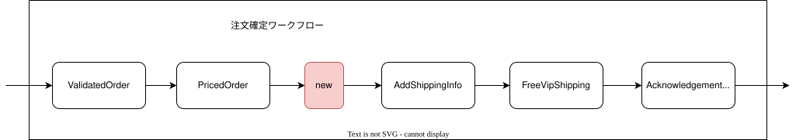
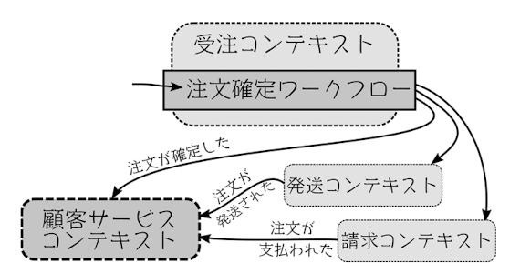

## 13.5 さらなる用件変更への対応

ex) 実装例

```go
// --------------------------------
// ワークフローの全体像
//
// NTOE: 各ステップの実装を組み合わせて、メインのワークフロー関数を作成する
// --------------------------------

func PlaceOrder(
	checkProductCodeExists CheckProductCodeExists, // 依存関係
	checkAddressExists CheckAddressExists, // 依存関係
	getProductPrice GetProductPrice, // 依存関係
        addShippingInfoToOrder AddShippingInfoToOrder, // 依存関係
        validateCustomerInfo ValidateCustomerInfo, // 依存関係
	calculateVipShippingCost calculateVipShippingCost, // 依存関係
	sendOrderAcknowledgment SendOrderAcknowledgment, // 依存関係
) func(api.UnvalidatedOrder) []api.OrderEvent { // 関数の定義

	return func(unvalidatedOrder api.UnvalidatedOrder) []api.OrderEvent {
		validatedOrder := ValidateOrder(checkProductCodeExists, checkAddressExists, unvalidatedOrder)
		pricedOrder := PriceOrder(validatedOrder, getProductPrice)
                pricedOrderWithShippingInfo := AddShippingInfo(pricedOrder, addShippingInfoToOrder)  // 配送料追加オプション
                pricedOrderWithVipShipping := FreeVipShipping(pricedOrderWithShippingInfo, calculateVipShippingCost) // VIP用配送料計算
		acknowledgmentOption := acknowledgeOrder(pricedOrderWithVipShipping, createOrderAcknowledgmentLetter, sendOrderAcknowledgment)
		events := createEvents(pricedOrder, acknowledgmentOption)
		return events
	}
}
```


#### `VIP`が米国内での発送の際にのみ送料が無料になる

* ワークフローの`freeVipShipping`セグメントのコードを変更すればいい
* 小さなセグメンを多く持つことで複雑さが抑えられる


#### 顧客は注文を複数の発送に分けることができるようになる

* そのためのロジック（ワークフロー内の新しいセグメント)が必要
* ワークフローの出力に含まれて発送コンテキストに送信されるのかが、単一の発送ではなく`発送のリスト`になる




#### 顧客は注文の状態が見られるようになる(発送されたかどうか／支払いがすべて終わっているかなど)

* 注文の状態に関す知識は複数のコンテキストに分散している
* 発送の状態: 発送コンテキストが知っている
* 請求の状態: 請求コンテキストが知っている
* 最適な方法
    * 新しいコンテキスト（「カスタマーサービス」）を作成する
    * 他のコンテキストからのイベントを受け取り、それに応じて状態を更新できる
    * 上程に関するすべての問い合わせはこのコンテキストに直接送られるようになる



